English | [Español](README.md)

<strong>VIORENCIA | PASS SAFE</strong>

  
  

**VIORENCIA | PASS SAFE** is a modern password and two-factor authentication (2FA) manager designed under a **Zero-Knowledge** architecture. All heavy cryptographic logic is executed locally on your device using **Rust compiled to WebAssembly (WASM)** (on the web and browser extension) and via **native Kotlin with high-security cryptography** (on the Android app), ensuring that your master keys and secrets never travel or get exposed over the network in plain text.

 

### 🚀 Downloads and Access

| Platform | Status | Download / Access Link |
| :--- | :---: | :--- |
| **Web Portal** | Available | [Access the Web](https://viorencia.com/vpass/) |
| **Firefox Extension** | Published | [Download from Mozilla Add-ons](https://addons.mozilla.org/es/firefox/addon/viorencia-pass-safe/) |
| **Android App** | APK (v1.1.4) | [Download vpass-1.1.4.apk](https://github.com/viorencia/VIORENCIA-PASS-SAFE/releases/download/v1.1.4/vpass-1.1.4.apk) |

### 📱 Installation on Android (v1.1.4)

To install the application directly on your Android device:

1. **Download the APK file**: Click the download button above or directly on this link: [Download APK (v1.1.3)](https://github.com/viorencia/VIORENCIA-PASS-SAFE/releases/download/v1.1.3/vpass-1.1.3.apk).
2. **Allow unknown sources**: As this is an external app outside Google Play, your device will ask for confirmation. Enable the **"Allow from this source"** or **"Unknown sources"** option in your browser or file manager settings when prompted.
3. **Install and Run**: Open the downloaded file and press **Install**. Ready!

> [!TIP]
> Remember that the mobile app supports **BiometricPrompt** (quick unlock using fingerprint recognition) and integrates as an Android **AutofillService** to autofill your passwords in any app.

### 🛡️ How does security work? (Zero-Knowledge)

The security of vPass is based on the premise that **we cannot see your data even if we wanted to**.

```mermaid
sequenceDiagram
    autonumber
    actor User
    participant WASM as WebAssembly (Rust)
    participant DB as Supabase (Encrypted)

    User->>WASM: Enters master password
    Note over WASM: Key derivation via PBKDF2 (100k iterations)
    WASM->>User: Generates Encryption Key in memory (RAM)
    
    rect rgb(30, 20, 20)
        Note over WASM, DB: Reading / Writing Secrets
        WASM->>WASM: Encrypts secrets locally with AES-256-GCM
        WASM->>DB: Stores ciphertext only (AES encrypted)
    end
```

1. **Local Key Derivation:** When you enter your master password, Rust computes a 256-bit cryptographic key using **PBKDF2** with **100,000 iterations** and a unique salt.
2. **AES-GCM-256 Encryption:** Any credential (username, password, TOTP, notes) is encrypted locally in your browser or mobile phone using **AES-GCM-256**.
3. **Blind Storage:** Data travels to the database (Supabase) already encrypted. Supabase acts strictly as a blind storage for ciphertexts.
4. **Secure Unlock (Knock Code):** Allows configuring a silent, local tap pattern on your device to speed up daily unlocking without exposing your master password in RAM for long periods.

### ✨ Main Features

* 🔑 **Intelligent Auto-save:** Capture and save passwords when signing up or logging in to third-party websites using the browser extension.
* 🕒 **Real-Time Sync:** Instant synchronization via Supabase WebSockets. Changes in the web portal are immediately reflected in your extension and mobile device.
* 📱 **Native Autofill on Android:** Integration with the Android operating system as an `AutofillService` to automatically fill credentials in any app or browser.
* 🔓 **Secure Biometric Access:** Fast and secure unlocking using Android fingerprint recognition (`BiometricPrompt`), protecting keys within the secure hardware of the device.
* 💾 **Local Encrypted Persistence (Mobile):** Local storage on the Android device via a **Room + SQLCipher** database, encrypting the entire vault at the physical disk level.
* 🚨 **Local Security Audit:** Permanent compromise audit (**Have I Been Pwned**). Computes the SHA-1 hash of your passwords locally and queries anonymously using **k-Anonymity** (sending only the first 5 characters of the hash).
* ⏳ **Trusted 2FA Bypass:** The system remembers your browser and trusted IP combination to avoid requesting the TOTP on every login if the device is safe.
* 📥 **Import and Export:** Support for importing and exporting in JSON (plain or locally encrypted) and standard CSV format (compatible with Bitwarden, 1Password, etc.).

### 🛠️ Technologies Used

* **Cryptography and Core (Web/Extension):** Rust, WebAssembly (`wasm-bindgen`).
* **Frontend Web:** Vanilla HTML5, Premium CSS, JavaScript (Vite).
* **Backend and Database:** Supabase (Auth, PostgreSQL, Realtime WebSockets).
* **Browser Extension:** Manifest V3 (WebExtensions API).
* **Mobile App (Android):** Native Kotlin, **Jetpack Compose (Material 3)**, Ktor Client (CIO), **Room Database**, **SQLCipher** (local database encryption), **AndroidX Biometric**, **AndroidX Security Crypto**, and **BouncyCastle**.

  v.pass © 2026  Manu Lara

