#  VIORENCIA | PASS SAFE

**VIORENCIA | PASS SAFE** es un gestor de contraseñas y códigos de doble factor (2FA) moderno, diseñado bajo una arquitectura **Zero-Knowledge** (conocimiento cero). Toda la lógica criptográfica pesada se ejecuta localmente en tu dispositivo mediante **Rust compilado a WebAssembly (WASM)**, garantizando que tus claves maestras y secretos nunca viajen ni se expongan en la red en texto plano.

---

## 🚀 Descargas y Acceso

| Plataforma | Estado | Enlace de Descarga / Acceso |
| :--- | :---: | :--- |
| **Portal Web** | Disponible | [Acceder a la Web](https://viorencia.com/vpass/) |
| **Extensión Firefox** | Publicado | [Descargar de Mozilla Add-ons](https://addons.mozilla.org/es/firefox/addon/viorencia-pass-safe/) |
| **Aplicación Android** | APK Estable | [Descargar `.apk` directo](https://github.com/viorencia/VIORENCIA-PASS-SAFE/releases/latest) |
| **Extensión Chrome** | En revisión | *Próximamente* |

---

## 🛡️ ¿Cómo funciona la seguridad? (Zero-Knowledge)

La seguridad de vPass se basa en el principio de que **nosotros no podemos ver tus datos aunque quisiéramos**. 

```mermaid
sequenceDiagram
    autonumber
    actor Usuario
    participant WASM as WebAssembly (Rust)
    participant DB as Supabase (Cifrado)

    Usuario->>WASM: Introduce contraseña maestra
    Note over WASM: Derivación de clave mediante PBKDF2 (100k iteraciones)
    WASM->>Usuario: Genera Clave de Cifrado en memoria (RAM)
    
    rect rgb(30, 20, 20)
        Note over WASM, DB: Lectura / Escritura de Secretos
        WASM->>WASM: Cifra los secretos en local con AES-256-GCM
        WASM->>DB: Almacena únicamente texto cifrado (cifrado AES)
    end
```

1. **Derivación de Clave Local:** Cuando introduces tu contraseña maestra, Rust calcula una clave criptográfica de 256 bits mediante **PBKDF2** con **100,000 iteraciones** y una sal única.
2. **Cifrado AES-GCM-256:** Cualquier credencial (usuario, contraseña, TOTP, notas) se cifra localmente en tu navegador o móvil utilizando **AES-GCM-256**.
3. **Almacenamiento Ciego:** Los datos viajan a la base de datos (Supabase) ya cifrados. Supabase actúa únicamente como un almacenamiento ciego de textos cifrados.
4. **Desbloqueo Seguro (Knock Code):** Permite configurar un patrón de toques silencioso y local en tu dispositivo para acelerar el desbloqueo diario sin exponer tu contraseña en RAM durante tiempos prolongados.

---

## ✨ Características Principales

* 🔑 **Autoguardado Inteligente:** Captura y guarda contraseñas al registrarte o iniciar sesión en webs de terceros mediante la extensión de navegador.
* 🕒 **Sincronización en Tiempo Real:** Los cambios realizados en el portal web se reflejan instantáneamente en tu extensión de navegador y dispositivo móvil mediante WebSockets de Supabase en caliente.
* 🚨 **Auditoría de Seguridad Local:** Auditoría permanente contra bases de datos de brechas de seguridad (**Have I Been Pwned**). Se calcula el hash SHA-1 de tus contraseñas localmente y se consulta de forma anónima mediante **k-Anonymity** (enviando solo los primeros 5 caracteres del hash) para avisarte si tus contraseñas han sido expuestas públicamente.
* ⏳ **Bypass 2FA de Confianza:** Si activas el Doble Factor, el sistema recordará de forma segura la combinación de tu navegador (`device_id`) e IP de confianza para no exigirte el código TOTP en cada inicio de sesión.
* 📥 **Importación y Exportación:** Soporte para importar y exportar tus credenciales en JSON (plano o cifrado localmente) y formato CSV compatible con otros gestores (Bitwarden, 1Password, etc.).

---

## 🛠️ Tecnologías Utilizadas

* **Criptografía y Core:** Rust, WebAssembly (`wasm-bindgen`).
* **Frontend Web:** Vanilla HTML5, CSS Premium, JavaScript (Vite).
* **Backend y Base de Datos:** Supabase (Auth, PostgreSQL, Realtime WebSockets).
* **Extensión de Navegador:** Manifest V3 (WebExtensions API).
* **App Móvil:** Android Nativo / APK.

---

*Desarrollado con ❤️ por [Manuel Lara López](https://viorencia.com).*
