<strong>VIORENCIA | PASS SAFE</strong>

  
  

**VIORENCIA | PASS SAFE** es un gestor de contraseñas y códigos de doble factor (2FA) moderno, diseñado bajo una arquitectura **Zero-Knowledge** (conocimiento cero). Toda la lógica criptográfica pesada se ejecuta localmente en tu dispositivo mediante **Rust compilado a WebAssembly (WASM)** (en la web y extensión de navegador) y a través de **Kotlin nativo con criptografía de alta seguridad** (en la aplicación Android), garantizando que tus claves maestras y secretos nunca viajen ni se expongan en la red en texto plano.

 

### 🚀 Descargas y Acceso

| Plataforma | Estado | Enlace de Descarga / Acceso |
| :--- | :---: | :--- |
| **Portal Web** | Disponible | [Acceder a la Web](https://viorencia.com/vpass/) |
| **Extensión Firefox** | Publicado | [Descargar de Mozilla Add-ons](https://addons.mozilla.org/es/firefox/addon/viorencia-pass-safe/) |
| **Aplicación Android** | APK (v1.1.2) | [Descargar vpass-1.1.2.apk](https://github.com/viorencia/VIORENCIA-PASS-SAFE/releases/download/v1.1.2/vpass-1.1.2.apk) |

### 📱 Instalación en Android (v1.1.2)

Para instalar la aplicación en tu dispositivo Android de forma directa:

1. **Descarga el archivo APK**: Haz clic en el botón de descarga superior o directamente en este enlace: [Descargar APK (v1.1.2)](https://github.com/viorencia/VIORENCIA-PASS-SAFE/releases/download/v1.1.2/vpass-1.1.2.apk).
2. **Permitir orígenes desconocidos**: Al ser una aplicación externa a Google Play, tu dispositivo te pedirá confirmación. Activa la opción **"Permitir desde esta fuente"** u **"Orígenes desconocidos"** en los ajustes de tu navegador o del gestor de archivos cuando se te solicite.
3. **Instalar y Ejecutar**: Abre el archivo descargado y presiona **Instalar**. ¡Listo!

> [!TIP]
> Recuerda que la aplicación móvil soporta **BiometricPrompt** (desbloqueo rápido mediante huella digital) y se integra como un **AutofillService** de Android para autocompletar tus contraseñas en cualquier app.

### 🛡️ ¿Cómo funciona la seguridad? (Zero-Knowledge)

La seguridad de vPass se basa en el principio de que **nosotros no podemos ver tus datos aunque quisiéramos**. 

```mermaid
sequenceDiagram
    autonumber
    actor Usuario
    participant WASM as WebAssembly (Rust)
    participant DB as Supabase (Cifrado)

    Usuario->>WASM: Introduce contraseña maestra
    Note over WASM: Derivación de clave mediante PBKDF2 (100k iteraciones)
    WASM->>Usuario: Genera Clave de Cifrado en memoria (RAM)
    
    rect rgb(30, 20, 20)
        Note over WASM, DB: Lectura / Escritura de Secretos
        WASM->>WASM: Cifra los secretos en local con AES-256-GCM
        WASM->>DB: Almacena únicamente texto cifrado (cifrado AES)
    end
```

1. **Derivación de Clave Local:** Cuando introduces tu contraseña maestra, Rust calcula una clave criptográfica de 256 bits mediante **PBKDF2** con **100,000 iteraciones** y una sal única.
2. **Cifrado AES-GCM-256:** Cualquier credencial (usuario, contraseña, TOTP, notas) se cifra localmente en tu navegador o móvil utilizando **AES-GCM-256**.
3. **Almacenamiento Ciego:** Los datos viajan a la base de datos (Supabase) ya cifrados. Supabase actúa únicamente como un almacenamiento ciego de textos cifrados.
4. **Desbloqueo Seguro (Knock Code):** Permite configurar un patrón de toques silencioso y local en tu dispositivo para acelerar el desbloqueo diario sin exponer tu contraseña en RAM durante tiempos prolongados.

### ✨ Características Principales

* 🔑 **Autoguardado Inteligente:** Captura y guarda contraseñas al registrarte o iniciar sesión en webs de terceros mediante la extensión de navegador.
* 🕒 **Sincronización en Tiempo Real:** Sincronización instantánea mediante WebSockets de Supabase. Los cambios en el portal web se reflejan de inmediato en tu extensión y dispositivo móvil.
* 📱 **Autocompletado Nativo en Android:** Integración con el sistema operativo Android como un `AutofillService` para autocompletar credenciales en cualquier app o navegador de forma automática.
* 🔓 **Acceso Biométrico Seguro:** Desbloqueo rápido y seguro mediante huella dactilar de Android (`BiometricPrompt`), protegiendo las llaves en el hardware seguro del terminal.
* 💾 **Persistencia Cifrada Local (Móvil):** Almacenamiento local en el dispositivo Android mediante base de datos **Room + SQLCipher**, cifrando el cofre completo a nivel de disco físico.
* 🚨 **Auditoría de Seguridad Local:** Auditoría de compromiso permanente (**Have I Been Pwned**). Calcula el hash SHA-1 de tus contraseñas en local y consulta de forma anónima con **k-Anonymity** (enviando solo los primeros 5 caracteres del hash).
* ⏳ **Bypass 2FA de Confianza:** El sistema recuerda la combinación de tu navegador e IP de confianza para evitar solicitar el TOTP en cada inicio de sesión si el dispositivo es seguro.
* 📥 **Importación y Exportación:** Soporte para importar y exportar en JSON (plano o cifrado localmente) y formato CSV estándar (compatible con Bitwarden, 1Password, etc.).

### 🛠️ Tecnologías Utilizadas

* **Criptografía y Core (Web/Extensión):** Rust, WebAssembly (`wasm-bindgen`).
* **Frontend Web:** Vanilla HTML5, CSS Premium, JavaScript (Vite).
* **Backend y Base de Datos:** Supabase (Auth, PostgreSQL, Realtime WebSockets).
* **Extensión de Navegador:** Manifest V3 (WebExtensions API).
* **App Móvil (Android):** Kotlin nativo, **Jetpack Compose (Material 3)**, Ktor Client (CIO), **Room Database**, **SQLCipher** (cifrado local de base de datos), **AndroidX Biometric**, **AndroidX Security Crypto** y **BouncyCastle**.

  v.pass © 2026  Manu Lara

